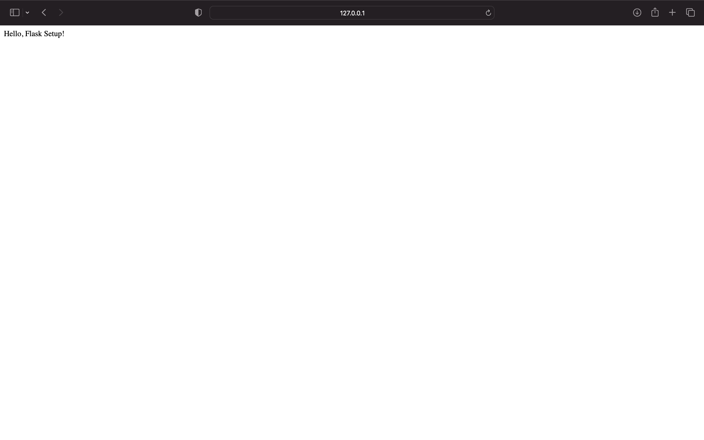

# Chapter 2: Setting Up Your Development Environment

A well-configured development environment is essential for a seamless workflow, especially when building complex applications involving backend, frontend, and AI components. In this chapter, we will guide you through setting up your environment to work with various frameworks and tools discussed in this book.

---

## 1. Importance of a Proper Development Environment

A good development environment ensures:

- **Consistency:** All team members work in a standardized setup.
- **Efficiency:** Reduced time troubleshooting environment-related issues.
- **Scalability:** Easy replication of the environment for production.

---

## 2. Tools and Prerequisites

Before diving into framework-specific setups, ensure you have the following tools installed:

### General Tools:

1. **Python (Version 3.8 or higher)**

   - Download from [python.org](https://www.python.org/).
   - Verify installation:
     ```bash
     python --version
     ```

2. **Node.js and npm** (Optional, depending on your project requirements)

   - Download from [nodejs.org](https://nodejs.org/).
   - Verify installation:
     ```bash
     node --version
     npm --version
     ```

3. **Docker** (Optional for containerized deployments)

   - Install from [docker.com](https://www.docker.com/).
   - Verify installation:
     ```bash
     docker --version
     ```

4. **Integrated Development Environment (IDE):**

   - An IDE simplifies coding by providing features like debugging, linting, version control, and plugin support. Here are some popular options:

     - **VS Code:**
       - Lightweight and extensible.
       - Supports Python development with extensions like "Python" and "Flask Snippets."
       - Download: [code.visualstudio.com](https://code.visualstudio.com/)

     - **PyCharm:**
       - Full-featured IDE tailored for Python.
       - Includes powerful debugging tools and Django/Flask support.
       - Download: [jetbrains.com/pycharm](https://www.jetbrains.com/pycharm/)

     - **IntelliJ IDEA (with Python Plugin):**
       - Great for multi-language projects, including Python and Java.
       - Download: [jetbrains.com/idea](https://www.jetbrains.com/idea/)

---

## 3. Framework-Specific Setup

### **3.1 Flask (Python)**

Below is a simple setup example for Flask:

```python
from flask import Flask

app = Flask(__name__)

@app.route("/")
def home():
    return "Hello, Flask Setup!"

if __name__ == "__main__":
    app.run(debug=True)
```

### Steps:

1. Save the code above as `flask_setup_example.py`.
2. Open the command prompt/terminal:
   - **Windows:** Press `Win + R`, type `cmd`, and press Enter.
   - **Mac:** Open `Spotlight Search` (`Cmd + Space`), type `Terminal`, and press Enter.
   - **Linux:** Open the Terminal application from your system menu or press `Ctrl + Alt + T`.
3. Run the application:
   ```bash
   python flask_setup_example.py
   ```
4. Open [http://127.0.0.1:5000](http://127.0.0.1:5000) in your browser to see the output.

#### Expected Output:
After opening the link, your browser should display the following output:



The full code is available here: [flask\_setup\_example.py](../code/chapter2/flask_setup_example.py)

---

### **3.2 FastAPI (Python)**

Below is a simple setup example for FastAPI:

```python
from fastapi import FastAPI

app = FastAPI()

@app.get("/")
async def read_root():
    return {"message": "Hello, FastAPI Setup!"}
```

### Steps:

1. Save the code above as `fastapi_setup_example.py`.
2. Run the application:
   ```bash
   uvicorn fastapi_setup_example:app --reload
   ```
3. Open [http://127.0.0.1:8000](http://127.0.0.1:8000) in your browser to see the output.

The full code is available here: [fastapi\_setup\_example.py](../code/chapter2/fastapi_setup_example.py)

---

### **3.3 Django (Python)**

Below is a simple setup example for Django:

1. Install Django:

   ```bash
   pip install django
   ```

2. Create a new Django project:

   ```bash
   django-admin startproject myproject
   ```

3. Navigate to the project directory and run the server:

   ```bash
   python manage.py runserver
   ```

4. Open [http://127.0.0.1:8000](http://127.0.0.1:8000) in your browser to see the default Django welcome page.

The full setup for Django is straightforward and well-documented in the [official Django documentation](https://docs.djangoproject.com/).

---

## 4. Common Issues and Troubleshooting

1. **Python Virtual Environment Issues:**

   - Activate the virtual environment before installing dependencies:
     ```bash
     source myenv/bin/activate   # Linux/Mac
     myenv\Scripts ctivate     # Windows
     ```

2. **Port Conflicts:**

   - If a port is in use, specify a new port (e.g., `app.run(port=8080)` in Flask).

---

By the end of this chapter, your development environment should be ready to handle the examples and projects in this book. Let’s move on to exploring the fundamentals of backend development!
